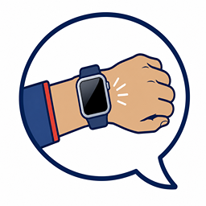
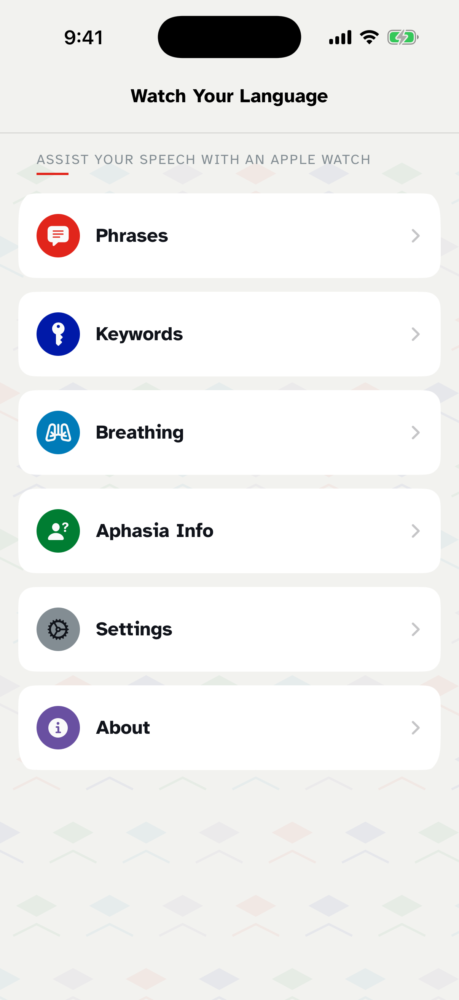
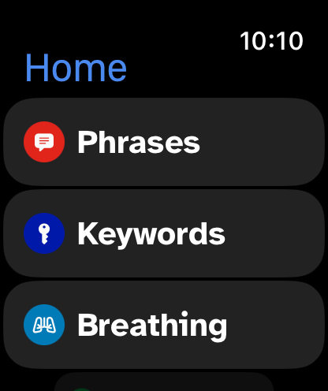

  

<h1 align="center">Watch Your Language</h1>

  A free, co-designed AAC app that helps people communicate from iPhone and Apple Watch.

  

  
  

  
  &nbsp;&nbsp;&nbsp;
  

Watch Your Language puts short, useful phrases within reach at the moment a
conversation happens. A wearer can show a phrase word by word on Apple Watch,
speak it aloud, or use the iPhone companion app to prepare and personalize
their communication.

## What it does

- Displays and speaks customizable phrases from iPhone and Apple Watch.
- Syncs phrases, keywords and preferences directly between paired devices.
- Keeps commonly forgotten words close to hand.
- Presents a disability card and an aphasia explainer with practical
  communication tips.
- Supports different speech voices, reading speeds and multilingual phrases.
- Includes a paced breathing exercise for moments when communication feels
  difficult.
- Works without an account, advertising, analytics or a developer-operated
  service.

## Co-designed for real conversations

The app grew from participatory design workshops with people with aphasia and
other communication needs, in partnership with
[Aphasia Re-Connect](https://aphasiareconnect.org/). The design treats a watch
as part of face-to-face communication: discreet, immediately available and
able to complement gesture, eye contact and other forms of expression.

The research behind the project is described in:

> Humphrey Curtis and Timothy Neate. 2023.  
> [*Watch Your Language: Using Smartwatches to Support Communication*](https://doi.org/10.1145/3597638.3608379).  
> In the 25th International ACM SIGACCESS Conference on Computers and
> Accessibility (ASSETS '23).

## Build the app

### Requirements

- macOS with Xcode 26.6
- iOS 26.5 SDK
- watchOS 26.5 SDK

Clone the repository, open `WatchYourLanguageAAC.xcodeproj`, choose the
`WatchYourLanguageAAC` scheme and run it on an iPhone simulator or device. The
project includes the `WatchYourLanguageAAC Watch App` target, which can also be
run directly on a paired Apple Watch simulator.

Signing is only required for physical devices and App Store distribution.
There are no third-party package dependencies or setup secrets.

## How it is organized

- `WatchYourLanguageAAC/` contains the iPhone companion interface.
- `WatchYourLanguageAAC Watch App/` contains the watch-specific interface.
- `Shared/` contains models, local stores, speech, design components and
  WatchConnectivity synchronization used by both apps.

The app is written in SwiftUI. Preferences and communication content are held
locally with `UserDefaults`; changes are passed between paired devices using
Apple's WatchConnectivity framework. Speech is generated on device with
`AVSpeechSynthesizer`.

## Privacy and support

Watch Your Language does not require an account and does not collect analytics,
advertising identifiers or personal data on developer-operated servers. See
the full [privacy policy](docs/privacy.md) and [support page](docs/support.md).

Found a problem or have an accessibility suggestion?
[Open an issue](https://github.com/HumphreyCurtis/Watch-Your-Language-AAC/issues).
Code contributions are welcome too; please read the
[contributing guide](CONTRIBUTING.md) before opening a pull request. Security
issues should be reported privately as described in the
[security policy](SECURITY.md).

## Acknowledgements

Thank you to the people with aphasia, communication partners and facilitators
who shaped the project, and to Aphasia Re-Connect for its partnership.

The interface uses
[Atkinson Hyperlegible](https://www.brailleinstitute.org/freefont/), distributed
under the SIL Open Font License included with the font files.

Watch Your Language is free and open source. If you would like to support its
continued development, you can
[sponsor Humphrey Curtis on GitHub](https://github.com/sponsors/HumphreyCurtis)
or [donate to Aphasia Re-Connect](https://aphasiareconnect.org/ways-to-help/donate/).

## License

Source code is available under the [MIT License](LICENSE).
